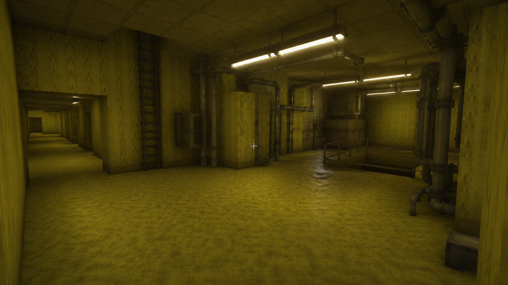
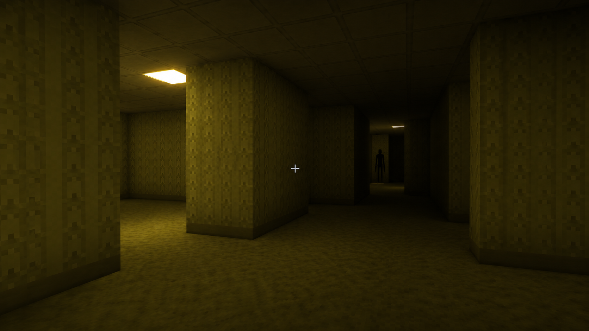
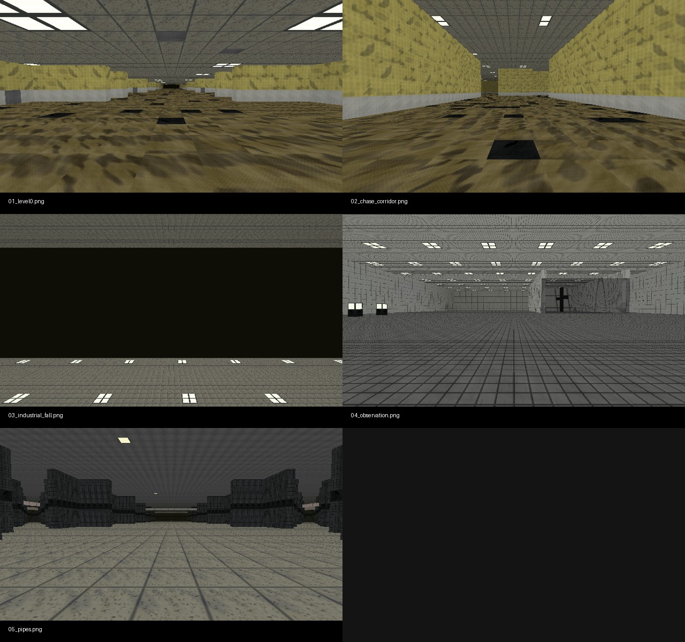

# Backrooms Cinematic for Minecraft Java 1.21.5

> **v0.5.2-rc1 pre-release.** The downloadable package is a migration candidate, not a stable Java 1.21.5 release. `level.dat` reports Minecraft 1.14.4 and has not completed an official-server migration or client verification in Java 1.21.5.

A cinematic Backrooms horror-adventure map intended for Minecraft Java Edition 1.21.5. Static review confirms a large Level 0 maze, chase sequence, industrial area, observation room, pipes, player-scoped objectives and several ending branches. It also detects environmental events and entity encounters in the data pack. A full client playthrough and multi-client test have **not** been completed.

## Current release status

Download the complete `v0.5.2-rc1` migration-candidate package from **Releases**. The original project ZIP has been preserved outside this repository. Do not treat this RC as evidence of completed Java 1.21.5 server migration, client rendering, story completion, or multiplayer testing.

When a release exists, download the complete integrated ZIP from **Releases**. Do not use GitHub's automatically generated `Source code.zip` as a game save.

## What static inspection found

- Four region files and a world-level `resources.zip` assembled by the build tool.
- One `backrooms_core` data pack with 126 `.mcfunction` files.
- Level 0, chase, industrial, observation, pipes and final-stage logic referenced by functions.
- Player-scoped task/ending scores plus shared world event and monster states.
- Eighteen custom sound entries and an HD resource pack, declared original by the project owner and licensed CC BY 4.0.

## Installation (after an approved release)

1. Download and verify `Backrooms_Java_1.21.5_v0.5.2_Integrated.zip` from Releases.
2. Extract it once; the first directory is `Backrooms_Cinematic_1.21.5_v0.5.2`.
3. Run `install_windows.bat` or `install_linux_macos.sh` inside that world directory, or manually copy that directory to Minecraft's `saves` directory.
4. Start Minecraft Java 1.21.5 and open the world. The resource pack is integrated as `resources.zip`; no duplicate resource-pack install is required.

The installers back up an existing same-name save before copying and never download software, request elevation, modify the registry, or delete user saves. See [installation details](docs/INSTALLATION.md).

## Play, commands, and multiplayer

The data pack exposes the photo trigger `br_photo` (values 1–5, and 99 for checkpoint return). Story and task state are reviewed from source, not playtested. See [story and gameplay](docs/STORY_AND_GAMEPLAY.md), [commands](docs/COMMANDS.md), and [multiplayer](docs/MULTIPLAYER.md).

Recommended settings are discussed in [compatibility](docs/COMPATIBILITY.md). Optional client mods are not included, required, or tested.

## Build and validate

```bash
python tools/build_release.py
python tools/validate_world.py
python tools/verify_release.py dist/Backrooms_Java_1.21.5_v0.5.2_Integrated.zip
```

The default build stops with a release-blocker error because the world still needs target-client migration evidence. That is intentional. The RC package was built with the explicit version override and remains unverified for target-client migration:

```bash
python tools/build_release.py --allow-version-mismatch
```

## Known RC limitations

- `level.dat`: DataVersion 1976 / Version.Name `1.14.4`; the data and resource packs target 1.21.5 formats but migration was not executed in this repository.
- Client rendering: not tested here.
- Complete story playthrough: not tested here.
- Multiplayer playthrough: not tested here.
- Performance and frame rate: not tested here.

## Visual references

### Owner-supplied client-view captures

These two images were supplied by the project owner as client-view captures. They are included as visual references, not as independent evidence of a complete client playthrough.





### World renders

The contact sheet and its five component images were rendered directly from this project's Anvil region files using the embedded resource-pack textures and v0.5.2 photo-point coordinates. They are not AI-generated and are not Minecraft F2 screenshots.



See [screenshots documentation](docs/SCREENSHOTS.md) for exact asset types, filenames and hashes.

## Contributing and licence

Code, tooling and documentation are MIT-licensed under [LICENSE-CODE](LICENSE-CODE). Original artistic and world assets are CC BY 4.0 under [LICENSE-ASSETS](LICENSE-ASSETS); see [NOTICE.md](NOTICE.md). Contributions are governed by [CONTRIBUTING.md](CONTRIBUTING.md), [CODE_OF_CONDUCT.md](CODE_OF_CONDUCT.md), and [SECURITY.md](SECURITY.md).

This is an unofficial fan-made project and is not affiliated with or endorsed by Mojang Studios, Microsoft, Kane Pixels, or any Backrooms rights holder.

Minecraft is a trademark of Microsoft Corporation. This repository contains an original fan-made adventure map and does not distribute the Minecraft game itself.
